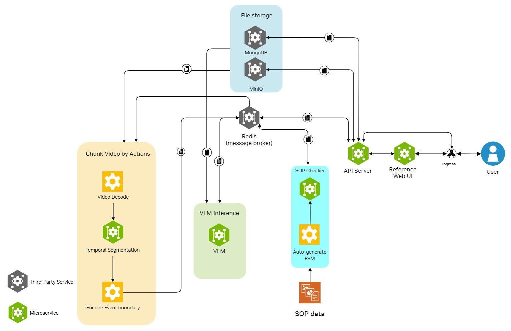
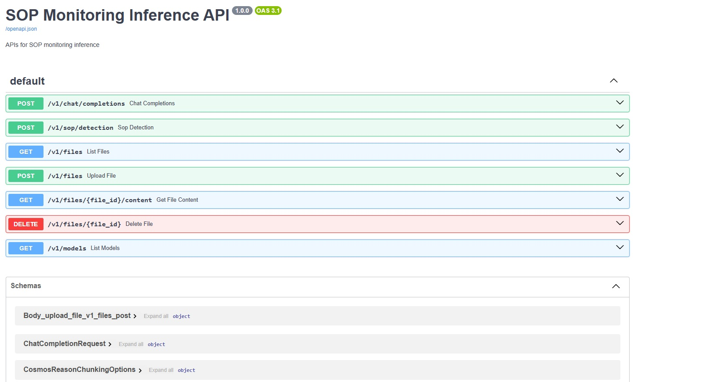
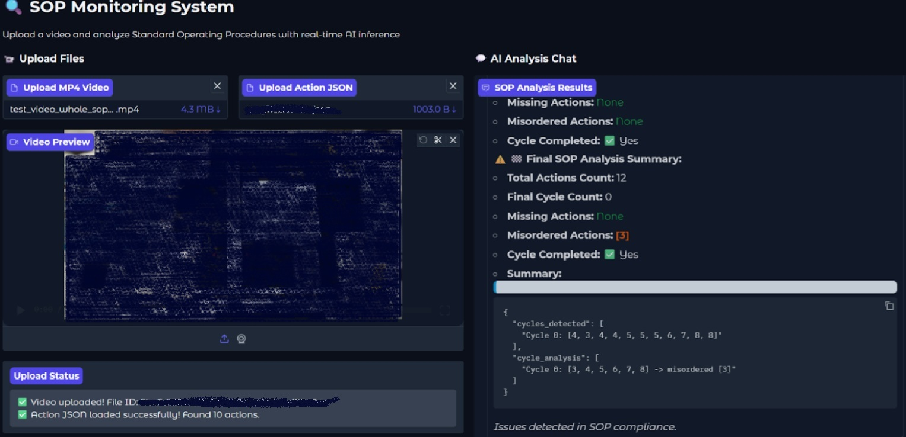

# SOP Monitoring Inference Blueprint

This repository contains the SOP (Standard Operating Procedure) Monitoring system, a computer vision platform designed to analyze and monitor the execution of SOPs. It's built on a robust, containerized microservices architecture, ensuring scalability and maintainability.

**Table of Contents**

- [Key Features ✨](#key-features-)
- [System Architecture 🏗️](#system-architecture-️)
- [Getting Started 🚀](#getting-started-)
  - [Prerequisites](#prerequisites)
  - [Installation & Setup](#installation--setup)
- [Configuration ⚙️](#configuration-️)
- [API Specifications 📖](#api-specifications-)
  - [Core Endpoints](#core-endpoints)
- [Examples & Demo UI 🖥️](#examples--demo-ui-️)
  - [Running Examples](#running-examples)
  - [Reference Web Application](#reference-web-application)
- [Acknowledgments 🙏](#acknowledgments-)

## Key Features ✨

* **Action Segmentation**: The system offers automatic video chunking. While uniform chunking is often sufficient, advanced algorithms that segment video based on event boundaries are also available to better handle actions of varying lengths.

* **VLM Inference**: It uses Vision Language Models (VLMs) for advanced video analysis and evenly distributes works on multiple GPUs to efficiently handle incoming requests.

* **SOP Detection**: Provides automated analysis of procedural compliance. The VLM outputs can be sent to the SOP Detection API for generating alerts and summaries.

* **RESTful API**: A comprehensive, OpenAI-compatible RESTful API allows for seamless integration with other applications and web services.

* **Reference UI**: A front-end web application is included to demonstrate how to use the APIs to build a complete alert and SOP summarization system.

## System Architecture 🏗️

The system uses a distributed microservices architecture where each component is containerized and managed by Docker Compose.



### Core Components

* **Nginx Ingress**: Acts as a reverse proxy, directing all external traffic to the appropriate service.

* **API Server**: The main entry point for all API requests that controls the overall inference workflow.

* **Redis**: Serves as a low-latency message broker for communication between services.

* **MinIO**: Provides S3-compatible object storage for files, such as uploaded videos.

* **MongoDB**: The primary database for storing application and file metadata.

* **Action Segmentation Service**: Responsible for chunking raw video footage for VLM inference.

* **VLM Inference Service**: Performs video analysis on GPUs and includes load balancing.

* **SOP Checker Service**: Analyzes VLM output to detect compliance with a defined SOP, identifying any missing or out-of-order steps.

* **Reference Web UI**: A user interface for interacting with and demonstrating the system's APIs.

## Getting Started 🚀

This section will guide you through setting up and running the SOP Monitoring system.

### Prerequisites

* **OS**: Ubuntu 22.04 or later.

* **Hardware**:

  * 64GB of System RAM.

  * At least one NVIDIA A100 GPU or a GPU with at least 80GB of RAM.

* **Software**:

  * Docker and Docker Compose.

  * NVIDIA Driver version 570.133.07 or above.

  * CUDA Version 12.8 or above.

* **Account**: An NVIDIA NGC account and a personal NGC key with permissions to download base images.

### Installation & Setup

1. **Clone the Repository**

   ```
   git clone <repository-url>
   cd sop-monitoring-blueprints/sop-inference-bp
   ```

2. **Login to NVCR**
   Log in to the NVIDIA Container Registry using Docker. Follow the instructions at `ngc.nvidia.com`.

   ```
   docker login nvcr.io
   ```

3. **Build Docker Images**
   This command builds all the service images.

   ```
   make -C docker build_services
   ```

4. **Download Required Models**

   * **VLM Model**: The VLM inference service can load any pre-trained compatible model, e.g, [nvidia/Cosmos-Reason1-7B](https://huggingface.co/nvidia/Cosmos-Reason1-7B). However, to use the SOP detection APIs, you must use a VLM specifically trained for SOPs, which can be done using the SOP Training Blueprint.

   * **Action Segmentation Models (Optional)**: If you plan to use `uboco` or `ddm-net` chunking algorithms, download the corresponding models.
   For UBOCO, please check [huggingface.co/OpenGVLab/ViCLIP](http://huggingface.co/OpenGVLab/ViCLIP) for ViClip and BPE weights, and [this modelzoo](https://github.com/linjieli222/HERO_Video_Feature_Extractor/blob/main/slowfast/README/MODEL_ZOO.md) for SlowFast weights. We usually choose `Kinetics/c2/SLOWFAST_8x8_R50`.
   For DDM-Net, please check [DDM-Net](https://github.com/MCG-NJU/DDM?tab=readme-ov-file#performance).

5. **Configure Environment**
   Navigate to the deployment directory and edit the `.env` file. You must update `VLM_INFERENCE_MODEL_PATH_ON_HOST` to the absolute path of your VLM model weights.

   ```
   cd deployment/docker_compose
   vim .env
   ```

   You can also remove unused images from [compose.yml](./deployment/docker_compose/compose.yml). But note that most images including `action_segment_service` are by default necessary. In the future we will think about how to make users easier to turn on or off services.

   `action_segment_service_cr` is disabled because we still need to investigate its capability.

6. **Launch Services**
   Start the entire application stack using Docker Compose.

   ```
   cd deployment/docker_compose
   docker compose up -d # Use -d to run in the background
   ```

   Once started, you should see logs indicating that the VLM inference service has successfully initialized.

## Configuration ⚙️

The system is configured through environment variables in the [deployment/docker_compose/.env](./deployment/docker_compose/.env) file.

<details>
<summary><strong>Click to see Key Environment Variables</strong></summary>

### NGINX Ingress

* `NGINX_INGRESS_PORT`: External port Nginx listens on (default: 8080).

* `NGINX_INGRESS_CLIENT_MAX_BODY_SIZE`: Max size for file uploads (e.g., `2GB`).

### API Server

* `API_SERVER_PORT`: Internal port for the API server (default: 8000).

* `API_SERVER_WORKERS`: Number of worker processes (default: 8).

### VLM Inference Service

* `VLM_INFERENCE_MODEL_PATH_ON_HOST`: **(Required)** Absolute path on the host to your VLM model weights.

* `VLM_INFERENCE_SHM_SIZE`: Shared memory size (e.g., `8gb`).

### Action Segmentation Service

* `ACTION_SEGMENT_UBOCO_*_ON_HOST`: Host paths to UBOCO model files. Assign an arbitrary path if not used.

* `ACTION_SEGMENT_DDM_NET_CHECKPOINT_PATH_ON_HOST`: Host path to the DDM-Net model. Assign an arbitrary path if not used.

* `ACTION_SEGMENT_CR_*`: Cosmos-Reason-1 as action segmentation algorithm requires different environment, so it has a suffix `_CR` to indicate the corresponding image name and path.

### Databases & Brokers

* `REDIS_MSG_BROKER_PORT`: Port for Redis (default: 6379).

* `MINIO_API_PORT`: API port for MinIO (default: 9000).

* `MINIO_ROOT_USER` / `MINIO_ROOT_PASSWORD`: MinIO credentials.

* `MONGO_PORT`: Port for MongoDB (default: 27017).

* `MONGO_INITDB_ROOT_USERNAME` / `MONGO_INITDB_ROOT_PASSWORD`: MongoDB credentials.

### Reference Web Application

* `DEMO_WEB_APP_PORT`: Internal port for the demo UI (default: 7860).

* `DEMO_WEB_APP_ROOT_PATH`: URL path for the demo UI (default: `/sopmon-ui`).

</details>

## API Specifications 📖

The system exposes a full OpenAPI-compliant RESTful API. Once the service is running, you can access the interactive documentation:

* **ReDoc**: `http://<host>:<port>/redoc`

* **Swagger UI**: `http://<host>:<port>/docs`



### Core Endpoints

<details>
<summary><strong>POST /v1/chat/completions</strong></summary>

This is an OpenAI-compatible endpoint for VLM inference. It includes an optional
custom `chunking_options` field to select the video chunking algorithm.

```python
chat_response = client.chat.completions.create(
    model="placeholder",
    messages=[
        {
            "role": "user",
            "content": [
                {"type": "text", "text": "What is the operator doing?"},
                {
                    "type": "image_file",
                    "image_file": {
                        "file_id": uploaded_file.id,
                        "chunking_options": { "algorithm": "uniform" }
                    }
                }
            ]
        }
    ]
)
```

</details>

<details>
<summary><strong>File Management Endpoints (/v1/files)</strong></summary>

These endpoints are also OpenAI-compatible and can be called using the `openai` Python package for uploading, listing, downloading, and deleting files.

* `POST /v1/files`: Upload a file.

* `GET /v1/files`: List all available files.

* `GET /v1/files/{file_id}/content`: Download a specific file.

* `DELETE /v1/files/{file_id}`: Delete a file.

```python
from openai import OpenAI

client = OpenAI(base_url="http://localhost:8080/v1", api_key="")
with open("/path/to/video.mp4", "rb") as f:
    uploaded_file = client.files.create(file=f, purpose="vision")
```

</details>

<details>
<summary><strong>POST /v1/sop/detection</strong></summary>

This is the primary endpoint for analyzing SOP compliance by sending VLM output to it.

* `action_json`: A JSON object defining the SOP steps. It includes an `actions` list and an optional `actions_can_be_skipped` list for "padding" actions that should be ignored during analysis.

```json
{
    "action_json": {
        "actions": [
            "(1) IDLE",
            "(2) Action A",
            "(3) Action B",
            "(4) Some padding actions that are not a part of the SOP"
        ],
        "actions_can_be_skipped": [
            "(1) IDLE",
            "(4) Some padding actions that are not a part of the SOP"
        ]
    }
}
```

* `cycle_completion_threshold`, `cycle_boundary_threshold_low`, and `cycle_boundary_threshold_high`: These three parameters control the heuristic used to detect the start of a new SOP cycle when repeated or out-of-order steps are observed.

    For example, if an SOP has 6 steps and the system observes the sequence `[1, 2, 3, 4, 3, 4, 5, 6]`, it needs to decide if the second `3` is a mistake or the start of a new cycle. This is where the thresholds come in.

    The logic has two cases:

    **Case 1: The current cycle is "complete enough"**

    A new cycle is triggered if an action that has already been seen appears again, but only if the current cycle has passed a certain completion percentage.

    * **Controlled by**: `cycle_completion_threshold`
    * **Example**:
        * SOP has 6 total steps.
        * `cycle_completion_threshold` is set to `0.6`.
        * The threshold for completion is `6 * 0.6 = 3.6` steps.
        * The observed sequence is `[1, 2, 3, 4, ...]`. The system has seen max step index `4`, which is greater than the threshold of 3.6.
        * If the next step observed is `3`, i.e., the second `3` in this example, the system declares a new cycle because the completion threshold was met.

    **Case 2: A very early step appears after a very late step**

    A new cycle is triggered if an early-sequence step appears after a late-sequence step has already been completed.

    * **Controlled by**: `cycle_boundary_threshold_low` and `cycle_boundary_threshold_high`.
    * **Example**:
        * SOP has 6 total steps.
        * `cycle_boundary_threshold_low` = `0.4` (anything below step `6 * 0.4 = 2.4` is "low").
        * `cycle_boundary_threshold_high` = `0.8` (anything above step `6 * 0.8 = 4.8` is "high").
        * The observed sequence is `[1, 3, 4, 5, ...]`. The highest step seen is `5`, which is above the "high" threshold of 4.8.
        * If the next step observed is `2` (which is below the "low" threshold of 2.4), the system declares a new SOP cycle.

</details>

## Examples & Demo UI 🖥️

### Running Examples

The `tests` directory contains example Python scripts and a Jupyter Notebook to demonstrate the end-to-end flow.

First, install the required packages:

```
pip install openai opencv-python termcolor requests
```

Run the end-to-end script:

```
cd tests
python sop_monitoring_flow.py
```

### Reference Web Application

An interactive web UI is available for demonstrating the system's capabilities. Access it at:
`http://<host>:<NGINX_INGRESS_PORT>/sopmon-ui`

**Note**: The web UI currently only supports h264 encoded MP4 files. You can convert your video using `ffmpeg`:

```
ffmpeg -i input_video.mp4 -c:v h24 output_video_h264.mp4
```



## Acknowledgments 🙏

This project incorporates code from the following open-source repositories:

- **DDM-Net**: [MCG-NJU/DDM](https://github.com/MCG-NJU/DDM) - Generic event boundary detection for action segmentation
- **HERO Video Feature Extractor**: [linjieli222/HERO_Video_Feature_Extractor](https://github.com/linjieli222/HERO_Video_Feature_Extractor) - Video feature extraction for [UBOCO](https://arxiv.org/abs/2111.14799) algorithms

We thank the authors for their excellent work.
