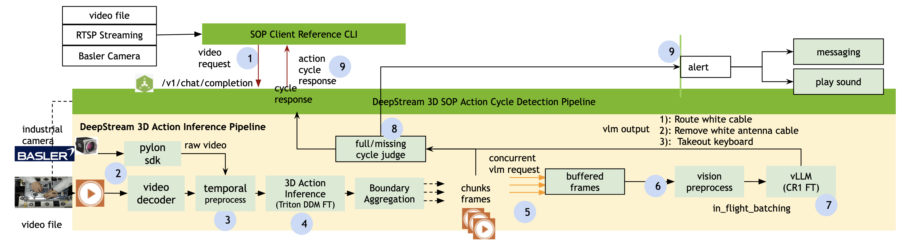

<!--
# SPDX-FileCopyrightText: Copyright (c) 2025-2026 NVIDIA CORPORATION & AFFILIATES. All rights reserved.
# SPDX-License-Identifier: LicenseRef-NvidiaProprietary
#
# NVIDIA CORPORATION, its affiliates and licensors retain all intellectual
# property and proprietary rights in and to this material, related
# documentation and any modifications thereto. Any use, reproduction,
# disclosure or distribution of this material and related documentation
# without an express license agreement from NVIDIA CORPORATION or
# its affiliates is strictly prohibited.
-->

# Nvidia DeepStream SOP Documentation

## Introduction

The DeepStream-SOP project implements a highly optimized computer vision inference for temporal action detection and VLM-based action evaluation pipeline, designed for low-latency processing of both video files and live Basler camera streams. The system operates as a real-time, accelerated microservice that produces operational insights for SOP-focused industry applications.

## Table of Contents

- [System Architecture](#architecture)
- [API Schema](#api-schema)
- [Getting started](#getting-started)
  - [Prepare Docker Container and Deploy Environments](#prepare-docker-container-and-deploy-environments)
  - [Download Required Model Checkpoints](#download-required-model-checkpoints)
  - [Launch SOP Microservice](#launch-sop-microservice)
- [Kafka Messaging Consumer](#kafka-messaging-consumer)
- [API Tests](#api-tests)
  - [Run API endpoints unit tests](#run-api-endpoints-unit-tests)
  - [Run API tests for video stream & camera](#run-api-tests-for-video-file-rtsp-live-stream-and-basler-camera-inputs)
    - [Test 1: Video File](#test-1-video-file-base64-encoded)
    - [Test 2: RTSP Live Stream](#test-2-rtsp-live-stream)
    - [Test 3: Basler Camera Live Streaming](#test-3-basler-camera-live-streaming)
- [Performance Profiling](#performance-profiling)
  - [API Client Performance Measurement](#api-client-performance-measurement)
  - [[Optional] [Developer] Profiling: Run the performance tests for the pipeline](#optional-developer-profiling-run-the-performance-tests-for-the-pipeline)
- [3rdparty License](#3rdparty-license)
- [Citation](#citation)

## System Architecture

The DeepStream-SOP microservice architecture integrates multiple components to deliver real-time temporal action detection and VLM-based evaluation:



**Key Components:**

- **Input Sources**: Supports video files, RTSP streams, and Basler camera live feeds
- **DeepStream Pipeline**: GPU-accelerated video processing using NVIDIA DeepStream SDK
- **Temporal Action Detection**: Real-time action recognition with [DDM](https://github.com/MCG-NJU/DDM) inference via Nvidia Triton acceleration
- **VLM Inference Evaluation**: Vision Language Model integration for intelligent action assessment using [Cosmos Reason Models](https://huggingface.co/nvidia/Cosmos-Reason1-7B) via vllm acceleration
- **API Server**: OpenAI-compatible REST interface for stream management and status monitoring
- **Output & Messaging**: Kafka messaging for event distribution, optional alert sounds, and video encoding capabilities

The architecture is designed for low-latency, high-throughput processing with configurable GPU memory utilization and flexible deployment options.

## API Schema

The DeepStream-SOP microservice exposes a RESTful API following OpenAI-compatible conventions. The complete API specification is available in OpenAPI 3.1.0 format.

**API Documentation:**
- **OpenAPI Spec**: [`docs/openapi.json`](docs/openapi.json)
- **Swagger UI**: Once the service is running, access the interactive API documentation at `http://localhost:8300/openapi.json`

**Main API Endpoints:**

- **Chat Completions** (`/v1/chat/completions`): Submit video streams for temporal action detection and VLM evaluation
- **File Management** (`/v1/files`): Upload, list, and manage video files
- **Health Checks** (`/v1/live`, `/v1/ready`, `/v1/startup`): Monitor service health and readiness
- **Models** (`/v1/models`): List available models
- **Metadata** (`/v1/metadata`): Retrieve service version and configuration information
- **Metrics** (`/v1/metrics`): Access Prometheus-compatible metrics

The API supports multiple input types including video files (base64 encoded), RTSP streams, and live Basler camera feeds.


## Getting started

### Prepare Docker Container and Deploy Environments

- **Pull source code and compose for deployment**

```
SOP_REPO=https://github.com/NVIDIA/sop-monitoring-blueprints.git
git clone https://github.com/NVIDIA/sop-monitoring-blueprints.git sop-monitoring-blueprints
cd sop-monitoring-blueprints/sop-inference-bp
```

- **Download Basler Pylon SDK (Required)**

  The build requires the Basler Pylon SDK, which is subject to separate license terms. Before building:

  1. Visit the official Basler website: [Pylon SDK 25.10.2](https://www.baslerweb.com/en/downloads/software/1932603569/)
  2. Complete the required registration form and agree to Basler's license terms
  3. Download `pylon-25.10.2_linux-x86_64_setup.tar.gz`
  4. Place the downloaded file in the `binaries/` directory:
     ```bash
     mkdir -p binaries
     mv ~/Downloads/pylon-25.10.2_linux-x86_64_setup.tar.gz binaries/
     ```

  **Note**: If the file is not present in `binaries/`, the Docker build will attempt to download it automatically. However, you should manually download and review the license terms before building.

- **Build the container**

```bash
docker compose -f deploy/compose.yaml build
```

- **Download Required Model Checkpoints**

  This DeepStream-SOP microservice requires users to download the VLM and temporal action detection models. For optimal accuracy, you must retrain/fine-tune the models, which can be done using the SOP Training Blueprint.

  - **VLM Model**: Use retrained models compatible with [nvidia/Cosmos-Reason1-7B](https://huggingface.co/nvidia/Cosmos-Reason1-7B).

  - **Temporal Action Detection Models**: Use retrained models compatible with DDM-Net. For more information, refer to the [DDM repository](https://github.com/MCG-NJU/DDM).

- **Configure deployment settings**

  Create and configure `deploy/.env` file:

```
# vim deploy/.env

# Specify the model folder on host, e.g. /opt/models
# Make sure all the testing models are placed in this folder
MODEL_ROOT_DIR="/opt/models"

# Specify Cosmos-Reason1-7B Model checkpoint folder
# It must be under folder $MODEL_ROOT_DIR
VLLM_MODEL_PATH="/opt/models/cosmos-reason1.1-7b/checkpoint"

# Specify DDM temporal action detection model path
# It must be under folder $MODEL_ROOT_DIR
DDM_MODEL_PATH="/opt/models/gbed_models/ddm/checkpoint.pth.tar"

# Specify DDM model input resolution, select from [512, 384, 224], default value: 224
DS_ACTION_IN_RESOLUTION=224

# Specify DDM model resize interpolation method, select from [nearest, bilinear], default value: nearest
DS_ACTION_IN_RESIZE_METHOD=nearest

# Specify cache path for vllm. Note that this path should be writable for the user in the microservice.
# The ddefault value of HOST_CACHE is $HOME/.cache/ds_sop, which might not be writable for the nvds_sop
# In this case, we can just remove the HOST_CACHE volumes mount in compose.yaml
# HOST_CACHE=/path/to/writable/by/nvds_sop

# Specify the video subsample framerate for vllm input
VLM_FPS=8.0

# Optional parameters passed to vllm inference.
# VLM_MAX_PIXELS=81920
# VLM_MAX_FRAMES=40
# VLM_MAX_TOTAL_PIXELS=12688256
# VLM_RESIZED_HEIGHT=567
# VLM_RESIZED_WIDTH=1008

# Specify whether to messaging chunk metadata through Kafka, disabled by default
#ENABLE_MESSAGING=1

# Specify whether to sound alert when a chunk is ready, disabled by default
# Users need to specify ALERT_SOUND_FILE from host
#ENABLE_ALERT_SOUND=1
# Specify a host wav file which will be mount into container's
# alert file path: /opt/nvidia/nvds_sop/stream/alert.wav
#ALERT_SOUND_FILE="/host/system/alert.wav"

# Optional: specify the default action config path on the host. The file
# will be mounted into container's $ACTION_CONFIG_PATH, The file must be JSON format.
# Check configs/actions.json for example
#ACTION_CONFIG_PATH=/host/path/to/actions/config.json


# Optional: specify the default VLM prompts path on the host. The file
# will be mounted into container's $VLM_PROMPT_PATH
# Check configs/vlm_prompts.txt for example
#VLM_PROMPT_PATH=/host/path/to/configs/vlm_prompts.txt

# Optional: specify the default CAMERA format for Basler devices. default value: RGB
# supported format up to the camera [RGB, YUY2, UYVY]
CAMERA_FORMAT=RGB

# Optional: specify GPU memory for the KV cache for performance
# VLLM_GPU_MEMORY_UTILIZATION=0.6

# Optional: specify max vllm request concurrency  for performance
# VLLM_MAX_NUM_SEQS=8

# Optional: specify the maximum total token sequence length of vlm
# VLLM_MAX_MODEL_LEN=50000

# Optional: Enable encoding and saving chunk files. Disabled by default
# ENCODE_VIDEO=0
# Optional: Specify host folder for file chunks, it will be mounted into
# container's /opt/nvidia/nvds_sop/chunks folder for chunks storage
# If specified, make sure any users have write/delete permission
# ENCODE_VIDEO_OUTPUT_DIR=/host/chunk/folder"

# Optional: Specify the host folder, it will be mounted into
# container's /tmp/nvds_sop_storage for file management.
# If specified, make sure any users have write/delete permission
# MEDIA_STORAGE_DIR=/host/media/folder

# Optional: specify which user_id to use for debug purpose only, default 1001
# USER_ID=0
# Optional: specify which group_id to use for debug purpose only, default 1001
# GROUP_ID=0

# Optional: for debug purpose only
# WORK_DIR_PATH="/opt/nvidia/nvds_sop"

# Optional: for debug purpose only
# PYTHONPATH="/opt/nvidia/nvds_sop"

# Optional: for debug purpose only
# API_DUMMY_TEST=0

```

### Launch SOP Microservice

- **Launch the microservice**

```
# Launch microservice
docker compose -f deploy/compose.yaml up -d
```

The microservice will launch 2 containers: `nvds-action-sop` and `kafka`.

- **Check microservice status**

```
# check the last 200 lines of logs
docker compose -f deploy/compose.yaml logs -f --tail=200 nvds-action-sop
```

When the server is started, you will see logs like
```
...
INFO:     Started server process [3469]
INFO:     Waiting for application startup.
2026-01-16 22:54:34,814 [INFO] [DS_ACTION_DETECTOR.__main__]: Application started
INFO:     Application startup complete.
INFO:     Uvicorn running on http://0.0.0.0:8300 (Press CTRL+C to quit)
```


- **Shutdown the microservice**

```
# After all the tests, to shutdown the microservice
docker compose -f deploy/compose.yaml down
```

## Kafka Messaging Consumer

When `ENABLE_MESSAGING=1` is enabled in `deploy/.env`, the microservice will publish
chunk metadata to the Kafka server after each video chunk is processed. This allows
real-time monitoring and integration with downstream systems.

**Start the Kafka consumer to view messages:**
```bash
docker compose -f deploy/compose.yaml exec nvds-action-sop python3 -m nvds_action_detector.messager --consumer
```

During each `/v1/chat/completions` request, you will see chunk metadata with nvprotobuf schema:
- Chunk ID and timestamp
- Video segment information (start/end time)
- VLM results
- SOP Checker results

## API Tests

### Run API endpoints unit tests

API schema could be found in Swagger [docs/openapi.json](docs/openapi.json)

Start the unittest for all MS playbook compliance tests
```
docker compose -f deploy/compose.yaml exec nvds-action-sop bash -c "TEST_VIDEO_PATH=/path/to/video.mp4 python3 tests/test_api_endpoints.py"
```

The unittest cover the following endpoints:
- Health check endpoints:
  - `GET /v1/live` - Service liveness check
  - `GET /v1/startup` - Service startup status
  - `GET /v1/ready` - Service readiness check
- Model endpoints:
  - `GET /v1/models` - List available models
- Metadata endpoint:
  - `GET /v1/metadata` - Show service metadata and version info
- Metrics endpoint:
  - `GET /v1/metrics` - Prometheus metrics for monitoring
- File management endpoints:
  - `POST /v1/files` - Upload a file
  - `GET /v1/files` - List all files
  - `GET /v1/files/{file_id}/content` - Download file content
  - `DELETE /v1/files/{file_id}` - Delete a file
- Chat completion endpoint:
  - `POST /v1/chat/completions` - Process video with AI model (supports streaming)


### Run API tests for video stream & camera

This test suite covers video file, RTSP stream, and Basler camera inputs.

```bash
# Basic test with video file
TEST_VIDEO_PATH=/path/to/video.mp4 python3 tests/api_client_test.py

# If running in container
docker compose -f deploy/compose.yaml exec nvds-action-sop bash -c "TEST_VIDEO_PATH=/path/to/video.mp4 python3 tests/api_client_test.py"
```

#### Test 1: Video File
Uses `test_chat_completion_basic()` - sends video file as base64 encoded data.

**Payload example:**
```json
{
  "model": "ds_sop_model",
  "messages": [{
    "role": "user",
    "content": [{
      "type": "video_url",
      "video_url": {
        "url": "data:video/mp4;base64,<base64_encoded_video>"
      }
    }]
  }],
  "stream": false,
  "chunking_options": {
    "algorithm": "ddm-net",
    "threshold": 0.8,
    "min_length_sec": 1.0,
    "max_length_sec": 10.0
  }
}
```

#### Test 2: RTSP Live Stream
Uses `test_video_rtsp_live_streaming()` - processes continuous RTSP video stream.

**Setup RTSP stream with VLC:**
```bash
# video.mp4 must use H.264/H.265 codec
cvlc --loop video.mp4 ":sout=#gather:rtp{sdp=rtsp://:8554/file-stream}" \
    :network-caching=1500 :sout-all :sout-keep
```

**Environment variable:**
```bash
export TEST_RTSP_VIDEO_URL="rtsp://0.0.0.0:8554/file-stream"
```

**Payload example:**
```json
{
  "model": "ds_sop_model",
  "messages": [{
    "role": "user",
    "content": [{
      "type": "video_url",
      "video_url": {
        "url": "rtsp://0.0.0.0:8554/file-stream"
      }
    }]
  }],
  "stream": true,
  "chunking_options": {
    "algorithm": "ddm-net",
    "threshold": 0.8,
    "min_length_sec": 1.0,
    "max_length_sec": 2.0
  }
}
```

#### Test 3: Basler Camera Live Streaming
Uses `test_physical_camera_live()` - processes live camera feed from Basler camera.

**Setup:**
- Install Pylon SDK 25.10.2 to get camera serial number via Pylon Viewer
- Find camera serial number (e.g., "40748152"), supported camera type: a2A2048-37gcPRO
- Optional: tune a Basler setting and save as `configs/Basler_camera_settings.pfs`, copy into the docker container.

**Environment variables:**
```bash
export PHYSICAL_CAMERA_ID="40748152" # camera serial number
export PHYSICAL_CAMERA_FORMAT="RGB"  # Options: RGB, UYVY, YUY2
```

**Payload example:**
```json
{
  "model": "ds_sop_model",
  "messages": [{
    "role": "user",
    "content": [{
      "type": "input_camera",
      "input_camera": {
        "camera_id": "40748152",
        "camera_vendor": "Basler",
        "camera_format": "RGB",
        "camera_width": 1280,
        "camera_height": 720,
        "camera_fps_num": 30,
        "camera_fps_den": 1
      }
    }]
  }],
  "stream": true,
  "chunking_options": {
    "algorithm": "ddm-net",
    "threshold": 0.8,
    "min_length_sec": 1.0,
    "max_length_sec": 2.0
  }
}
```

**Note:** For Basler cameras config file, add `"config": "configs/Basler_camera_settings.pfs"` to the `input_camera` object.

**Enable specific tests in code:**
Uncomment desired tests in `tests/api_client_test.py`:
```python
# test_instance.test_basler_camera_streaming_enumeration()
# test_instance.test_video_rtsp_live_streaming()
# test_instance.test_physical_camera_live(PHYSICAL_CAMERA_ID, "RGB", timeout_seconds=36)
```

## Performance Profiling

#### API Client Performance Measurement

For comprehensive performance testing of stream latency and throughput metrics using the `/v1/chat/completions` API endpoint with camera, RTSP, and file inputs, please refer to:

**[API Client Performance Test - Usage Guide](tests/README_perf.md)**

This guide provides detailed instructions for:
- Running performance tests with different stream types (camera/RTSP/file)
- Configuring environment variables and test parameters
- Understanding output metrics (stream startup time, chunk inference time, delays)
- Using the `StreamClient` class for automated performance measurement

### [Optional] [Developer] Profiling: Run the performance tests for the pipeline

- Running the pipeline for performance profiling
```
# update deploy/.env
vim deploy/.env

# update entrypoint to bash
ENTRYPOINT="/bin/bash"

# start container and run into terminal
docker compose -f deploy/compose.yaml up -d
docker compose -f deploy/compose.yaml attach nvds-action-sop

# make sure you are in the folder of nvds_action_detector
# check the model exist
ls $DDM_MODEL_PATH
ls $VLLM_MODEL_PATH

# start the benchmark test for E2E latency and throughput without API
# Disable sop checker for performance tests
DISABLE_SOP_CHECKER=1 python3 -m nvds_action_detector.ds_sop_process --video-path /path/to/test_video_whole_sop_h264.mp4 --batch-size 1

```

- Batch Size 1 is for single-stream, 8/16 for large concurrency.

```

# Run batch-size 8 test
DISABLE_SOP_CHECKER=1 python3 -m nvds_action_detector.ds_sop_process --video-path test_video_whole_sop_h264.mp4 --batch-size 8
```

## 3rdparty License
- Refer to `docker/Docker.build` for a complete list of third-party dependencies included in this project.
- This project will download and install additional third-party open source software projects. Review the
license terms of these open source projects before use.
- Building the final container from `docker/Docker.build` requires Basler Pylon SDK, which is subject to separate license terms. Users must independently download and accept the [Pylon SDK license terms](https://docs.baslerweb.com/pylonapi/cpp/licensing) before proceeding. The [Pylon-SDK-25.10](https://www.baslerweb.com/en/downloads/software/1932603569/) can be obtained from the official Basler website after completing the required registration form.

## Citation

This project utilizes [DDM-Net](https://github.com/MCG-NJU/DDM) for temporal action detection. If you use this DeepStream-SOP system in your research, please acknowledge the DDM-Net contribution by citing:

```bibtex
@InProceedings{Tang_2022_CVPR,
    author    = {Tang, Jiaqi and Liu, Zhaoyang and Qian, Chen and Wu, Wayne and Wang, Limin},
    title     = {Progressive Attention on Multi-Level Dense Difference Maps for Generic Event Boundary Detection},
    booktitle = {Proceedings of the IEEE/CVF Conference on Computer Vision and Pattern Recognition (CVPR)},
    month     = {June},
    year      = {2022},
    pages     = {3355-3364}
}
```
