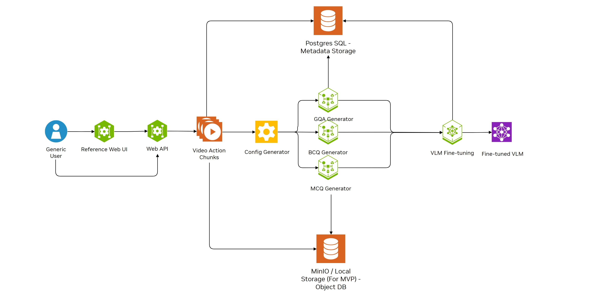

# SOP Training Blueprint

### Table of Contents
- [Overview](#overview)
- [Repository Structure Overview](#repository-structure-overview)
- [Components](#components)
- [Prerequisites](#prerequisites)
- [Installation and Setup](#installation-and-setup)
- [Services](#services)
- [Microservices API Specs](#microservices-apis)
- [Customization Config](#customization-config)
- [Customization Variables](#customization-variables)
- [Tutorial](#tutorial)
- [Troubleshooting](#troubleshooting)
- [License](#license)


## Overview

SOP training BP (Blueprint) is designed to facilitate Standard Operating Procedure (SOP) monitoring in industrial manufacturing environments by leveraging vision-language models (VLMs). Its primary goal is to train a VLM capable of identifying whether operators are following the correct procedural steps during task execution, providing a foundation for automated compliance verification and operational quality assurance.
To achieve this, the application is structured into three microservices, each responsible for a critical stage in the VLM training pipeline:

1. **Video Annotation Service**: Enables users to annotate raw video footage by marking the start and end timestamps of each SOP-related action. Each annotated segment is labeled with a corresponding SOP action index and description, forming the ground truth for downstream processing.


2. **Data and QA Augmentation Service**: Transforms annotated video data into structured question-answer (QA) formats to train the VLM. This service utilizes NVIDIA LLM NIM API to do QA augmentation. This module generates three types of QA pairs:

   * **GQA (General QA)**: General questions about the video.
   * **BCQ (Binary Choice QA)**: Yes/No style questions to verify action presence or absence.
   * **MCQ (Multiple Choice QA)**: Questions with multiple possible action choices to challenge model understanding.


3. **VLM Fine-Tuning Service**: Fine-tunes a pretrained vision-language model on the augmented QA dataset. The trained model is then capable of analyzing unseen video sequences to assess SOP adherence in real-time or batch settings.


SOP training BP provides a reference UI for ease of use. The UI underneath uses the 3 different microservices mentioned above.


## Repository Structure Overview
* `microservices`: Contain all source code for microservices
* `assets`: Contain all assets including pretrain weight, configs, logs, and data
* `db-init-scripts`: Contain metadata DB initialization
* `docker-compose.yml`: Local deployment config

## Components
<div align="center">
  
</div>

* Reference web UI is a React based user interface. It offers an easy to use interface that user can use to interact with the backend microservices
* The Video Action Chunks part represents the annotation microservice which would chunk input video into multiple action video chunks based on annotated start and end timestamp
* Config Generator, GQA Generator, BCQ Generator and MCQ Generator are all wrapped in the “Data / QA Augmentation” microservice. It’s responsible for generating multiple different format QAs given labelled SOP data
* VLM Fine-tuning microservice currently support [Cosmos-Reason1
](https://github.com/nvidia-cosmos/cosmos-reason1). More VLMs would be supported in the future
* The SOP training BP utilizes Postgres DB for storing videos, annotations and training metadata. All videos and training assets would be stored at the local file storage of the deployment server.


## Prerequisites
* Ubuntu 22.04 or later
* 4 * A100 (For full-finetuning with Cosmos-Reason1 at reasonable batch size)
* CUDA Version 12.8.1 or above
* NVIDIA Driver 550.144.03 for A100
* NVIDIA API key to make request to NVIDIA NIM API
   * Refer to [NVIDIA NIM](https://build.nvidia.com/explore/discover) for how to get the API key


## Installation and Setup
1. Clone the repo
```
git clone <repo-url>
cd sop-training-bp-deployment
```

2. Log in NGC and docker
```
# NGC
NGC config set

# Docker
docker login nvcr.io
```

3. Update .env
```
# replace NGC_API_KEY value
NGC_API_KEY=<your nvidia api key that can access LLM NIM API>
```

4. Create assets folders to be mounted
```
mkdir assets/data assets/logs assets/metadata_db assets/results assets/weights
```

5. Download model weight. The model weight can be downloaded in [Cosmos-Reason1 HuggingFace repo](https://huggingface.co/nvidia/Cosmos-Reason1-7B)


6. Run the SOP training BP
```
docker compose up
```

7. Stop service
```bash
# stop service but keep volumes
docker-compose down

# remove volumes as well
docker-compose down -v
```


## Services
After setting up training BP, there would be 3 microservices running.
1. **Annotation**

   * Frontend: (`annotation-frontend`)

      * Port: 80 (configurable via `FRONTEND_PORT`)

      * Simple UI for annotation and submitting job

   * Backend: (`annotation-backend`)

      * Port: 8100 (configurable via `ANNOTATION_BACKEND_PORT`)
      
      * Handle the annotation timestamp logic

2. **Data / QA Generation** (`sop-data-gen`)

   * Port: 5487 (configurable via `DATA_GEN_PORT`)
   
   * Generates GQAs, BCQs, MCQs format data for VLM fine-tuning

      * The GQAs generation would utilize NVIDIA LLM NIM for generation

      * Requires NVIDIA API Key

3. **VLM Fine-tuning** (`cosmos-reason1-microservice`)

   * Port: 32080 (configurable via `VLM_PORT`)

   * Performs Cosmos-Reason1 fine-tuning using generated data

   * Requires GPU access

4. Apart from the above microservices, the BP would initiate a DB (Postgres) and a reference DB management (Adminer) service when start up.
   *  Access to the Adminer:
      * Port: 8080
      * Server: `metadata_db`
      * Username: POSTGRES_USER
      * Password: POSTGRES_PASSWORD
      * Database: POSTGRES_DB
   * For using custom tool for access or manage metadata DB, please adjust the `docker-compose.yml` accordingly.


## Microservices APIs
1. **Annotation**: [api spec](microservices/video-annotator-ms/annotation_backend/api_spec/openapi_spec.json)

2. **Data / QA generation**: [api spec](microservices/data-generation-pipeline/api_spec/openapi_spec.json)

3. **VLM fine-tuning**: [api spec](microservices/api_spec/openapi.json)


## Customization Config
* `.env`: Local deployment variables. Microservices deployment port and NGC API Key can all be set here.

* `assets/config/augment_config.yaml`: Data / QA generation config. All the generation parameters can be set here.
   * **General config**:
      * `video_extension`: Video extension to be used (recommend using mp4)
   * **BCQ (Binary QA - Yes / No question and answer pairs) Config**:
      * `negative_ratio`: The positive and negative QA ratio (2.0 means there would be 1 yes QA and 2 no QA)
      * `subject`: Who conduct the SOP action
      * `exclude_action`: Actions to exclude from BCQ generation (ex: 1_2 means action 1 and 2 would be excluded from BCQ generation)
   * **Sequential MCQ (Multiple Choices QA) Config**:
      * `exclude_action`: Action to be excluded from the MCQ generation (ex: 3_5_8 means action 3, 5 and 8 would be excluded from the squential MCQ generation)
      * `max_chunk_len`: The maximum number of actions to be included into the generated MCQ chunk (2 means the generated MCQ chunk QA would include chunk containing action 1, chunk containing action 1 + 2, but not chunk containing action 1 + 2 + 3 or more)

   * **GQAs Config**:
      * `llm_type`: What types of LLM call to use
         * local: use local deployed LLM
         * nvidia: use NVIDIA LLM NIM API (API Key would be needed)
      * `local_llm_url`: Local deployed LLM URL
      * `llm`: NVIDIA NIM API LLM Model to be used for GQA augmentation
      * `num_qa_llm`: Number of QA pairs to be generated by LLM
      * `num_qa_per_chunk`: Number of QA pairs to sample from num_qa_llm to be the final GQA pairs
      * `exclude_action`: Action to be excluded from the GQA generation (ex: 1_2 means action 1 and 2 would be excluded from the GQA generation)
      * `ngc_personal_key`: The NVIDIA API key. Please noted that this would override the API Key set in `.env`
* `assets/config/train_config.toml`: Cosmos-Reason1 fine-tuning config. Training parameters such as epoch, learning rate, and pretrained model path can be set in this config. Please refer to [Cosmos-Reason1](https://github.com/nvidia-cosmos/cosmos-reason1) for more config details. The parameters listed below are handled by the microservice under the hood. No need to modify this manually.
   * `train.output_dir`
   * `logging.experiment_name`
   * `train.train_policy.dataset.name`
   * `train.train_policy.dataset.split`

   Custom vision parameters for training can be set under [custom.vision]. All the supported vision config can be found in [cosmos_reason1_utils](https://github.com/nvidia-cosmos/cosmos-reason1/blob/3723d31ea7d8be1f1d8ba890784f24613c2831a2/cosmos_reason1_utils/src/cosmos_reason1_utils/vision.py#L32)

## Customization Variables
* Refer to [here](microservices/video-annotator-ms/annotation_backend/utils/constant.py) for all annotation related environment variables
* Refer to [here](microservices/data-generation-pipeline/utils/constant.py) for all QA / data generation related environment variables
* Refer to [here](microservices/cr1_training_ms/utils/constant.py) for all Cosmos-Reason1 training related environment variables
   * The blueprint use custom dataset `./assets/tools/cosmos_custom_dataset.py` and config `./assets/config/train_config.toml` for Cosmos-Reason1 fine-tuning. If you want to use different custom dataset or config, add environment variable `CUSTOM_DATASET_NAME` for custom dataset and `TRAIN_CONFIG_NAME` for config to the docker-compose.yml env section of `cosmos-reason1-microservice`.

## Tutorial
This blueprint provide a [tutorial notebook](tutorials/sop_monitoring_training_flow.ipynb) for illustrating the usage via API calls.


## Troubleshooting

- Ensure you have Docker and Docker Compose installed
- Verify GPU drivers and nvidia-docker are properly configured
- Check that all required NGC credentials are set in the `.env` file
- Ensure the required directories exist and have proper permissions

## License
The software and materials in this repository are governed by the [NVIDIA Software and Model Evaluation License](https://www.nvidia.com/en-us/agreements/enterprise-software/nvidia-software-and-model-evaluation-license/)


This project will download and install additional third-party open-source software projects. Review the license terms of these open-source projects before use.
