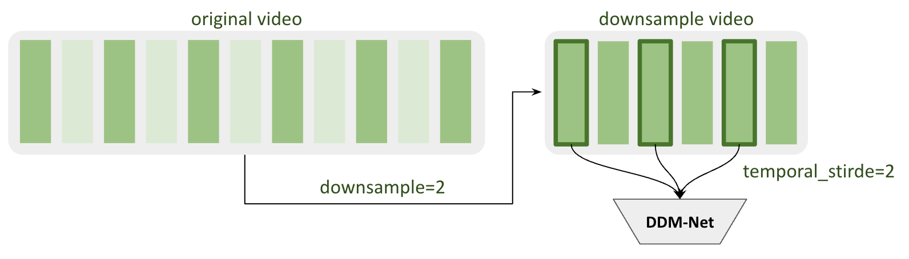

# 🌟 DDM-Net Configuration Guide

---

## 1. 🗂️ Dataset Configuration

```yaml
dataset_config:
  # Basic dataset settings
  dataset: "DDMDataset"             # Dataset class name
  resolution: 224                   # Input image resolution (int or [height, width])
  frames_per_side: 5                # Frames to sample before/after anchor (temporal context)
  downsample: 1                     # Downsampling rate along time
  min_change_dur: 0.3               # Minimum change duration (seconds)
  num_classes: 2                    # Output classes (e.g., "boundary", "background")
  seed: 42                          # For reproducibility

  # Video processing
  video_backend: "pyav"             # Video decoding backend ("pyav" or "torchcodec")

  # Dataloader config
  batch_size: 2                     # DataLoader batch size
  workers: 4                        # Number of worker threads

  train_config:
    mode: "train"
    anno_path: "/path/to/train/annotation.json"
    data_root: "/path/to/train/full/videos"

  val_config:
    mode: "val"
    anno_path: "/path/to/val/annotation.json"
    data_root: "/path/to/val/full/videos"
    temporal_stride: 1
```

> **Parameters:**
>
> - `batch_size` - Larger batch sizes are generally preferable for better convergence. It is recommended that `batch_size * num_gpus` be at least 32.
> - `resolution` - Input image size. Recommended: `224`, `384`, or `512`
> - `frames_per_side` - **Temporal context window (Sliding Window Size)**
>   - DDM-Net uses a sliding window to detect boundaries by comparing the current frame with neighboring frames.
>   - This parameter controls the **half-width** of this window (frames **before and after** the center).
>   - Example: If `frames_per_side = 5`, the window size is **11 frames**:
>     - Center frame (t)
>     - 5 frames before: (t-5, t-4, t-3, t-2, t-1)
>     - 5 frames after: (t+1, t+2, t+3, t+4, t+5)
>   - **Trade-off:**
>     - Larger values (e.g., 10) = More temporal context, better accuracy, but slower.
>     - Smaller values (e.g., 3) = Faster processing, but may miss subtle boundaries.
>
> - `downsample` - **Temporal downsampling rate**
>   - Controls frame sampling density along the time axis
>   - `downsample = 1`: Use every frame (no downsampling)
>   - `downsample = 2`: Skip every other frame (use half the frames)
>   - DDM-Net's training is usually fast and in order to let DDM-Net chunks video accurately, we suggest don't modify this parameter.
> - `temporal_stride` - **Sliding window stride (in units of `downsample`)**
>   - Controls how frequently boundary scores are computed (every **T** frames).
>   - **Efficiency:** Skips neighboring frames to speed up inference by moving the sliding window in larger steps.
>   - **Recommendation:** Set `temporal_stride = 1` for the best accuracy (computes scores for every valid frame position).
>   - The figure below demonstrates the difference between `downsample` and `temporal_stride`:
<p align="center">
  
</p>

>
> - `min_change_dur` - **Boundary label smoothing duration (in seconds)**
>   - Creates a "soft boundary region" instead of labeling only a single frame
>   - Example: If `min_change_dur = 0.3` and `fps = 30`:
>     - Boundary region = 0.3 × 30 = **9 frames**
>     - Frames within ±4.5 frames of the boundary are all labeled as boundaries
>   - **Why?** Makes training more robust by accounting for annotation uncertainty
>
> - `video_backend` - Video decoding engine
>   - `"pyav"` (recommended): More stable, handles various video formats well
>   - `"torchcodec"`: Faster decoding if available, but may have compatibility issues
>
> - `num_classes` - Number of output classes (default: 2)
>
> - `anno_path`, `data_root` - Dataset paths
>   - `anno_path`: Path to annotation JSON file
>   - `data_root`: Directory containing video files

---

## 2. 🧠 Model Configuration

```yaml
model_config:
  model_name: "multiframes_resnet"     # Main model architecture
  backbone: "resnet50"                 # DDM-Net's feature extractor
  pretrained: true                     # Whether to load feature extractor's (resnet) pretrained weight or not
  freeze_backbone: true                # Freeze backbone during training (transfer learning)
  num_classes: 2                       # Should match dataset_config.num_classes
  img_size: 224                        # Optional: Fix input size if different from resolution
```

> **Hints & Notes:**
>
> - `backbone` - Feature extractor architecture
>   - **`resnet50`**: Recommended starting point (good balance of speed/accuracy)
>
> - `pretrained` - Use pretrained weights or random initialization
>   - `true`: Load ImageNet pretrained weights (recommended)
>     - Supported for ResNet models (auto-downloads from NVIDIA's commercial checkpoints)
>   - `false`: Random initialization (train from scratch)
>
> - `freeze_backbone` - Whether to freeze backbone weights during training
>   - `false` (recommended for ResNet50): Fine-tune the entire network
>     - Use when you have sufficient training data
>     - Better performance but requires more memory
>   - `true`: Only train the classification head
>     - Use for transfer learning with small datasets
>     - Faster training, less memory
>
> - `num_classes` - Must match `dataset_config.num_classes` (typically 2 for boundary detection)

---

## 3. ⚙️ Training Configuration

```yaml
training_config:
  epochs: 30                   # Total training epochs
  optimizer: "adamw"           # Optimizer ("adam", "adamw", "sgd", etc.)
  learning_rate: 0.001         # Initial learning rate
  weight_decay: 0.0001         # Weight decay strength
  scheduler: "step"            # LR scheduler type
  warmup_epochs: 2             # Warmup epochs at training start

  amp: false                   # Enable mixed-precision training (faster, less memory)
  model_ema: false             # Use model Exponential Moving Average for smoothing
  model_ema_decay: 0.9998      # EMA decay (closer to 1 = slower update)

  num_gpus: 1                  # GPUs to use
  num_nodes: 1                 # Distributed: nodes
  strategy: "auto"             # Training strategy (e.g., "auto", "ddp")
  output: "./output"           # Where to save checkpoints/logs
  exp_name: "exp"              # Experiment name (used in output folder)
  eval_metric: "f1_score"      # Metric for model selection/comparison
```

> **Tips:**
>
> - `optimizer` - Optimization algorithm
>   - `adamw` (recommended): Adam with weight decay, generally more stable
> - `learning_rate` - Initial learning rate
>   - Recommended: `0.0001` (1e-4) for AdamW
>   - Adjust if training is unstable (reduce by 10x) or too slow (increase by 2-5x)
>
> - `scheduler` - Learning rate schedule
>   - `step`: Reduce LR by `decay_rate` every `decay_epochs` (simple, effective)
>   - `cosine`: Smoothly decrease LR following cosine curve
>
> - `warmup_epochs` - Gradual learning rate warm-up
>   - Starts with low LR, gradually increases to `learning_rate`
>   - **Why?** Prevents unstable training at the beginning
>   - Use 2-5 epochs for small datasets, 5-10 for large datasets
>
> - `amp` - Automatic Mixed Precision (FP16 training)
>   - **Set to `false` for DDM-Net** (required for stability)
>   - DDM-Net contains modules that need float32 precision during training
>
> - `model_ema` - Exponential Moving Average of model weights
>   - **Recommended: `true`** for better validation performance
>   - Maintains a smoothed version of weights during training
>   - Often gives +1-2% improvement in metrics
>
> - `model_ema_decay` - EMA smoothing factor
>   - Range: 0.99 to 0.9999 (closer to 1 = slower update, smoother weights)
>   - Default: `0.9998` works well for most cases
>
> - `eval_metric` - Metric for model selection
>   - `f1_score` (recommended): Balance of precision and recall
>   - `loss`: Save models with lowest validation loss
>
> - **Multi-GPU Training:**
>   - `num_gpus`: Number of GPUs per node (e.g., `1`, `2`, `4`, `8`)
>   - `num_nodes`: Number of machines (default: `1`)
>   - `strategy`: 
>     - `"auto"` (recommended): Automatically chooses best strategy
>     - `"ddp"`: Distributed Data Parallel (explicit multi-GPU)
>
> - **Output & Logging:**
>   - `output`: Base directory for saving results (checkpoints, logs, visualizations)
>   - `exp_name`: Experiment name (creates subfolder: `output/train/exp_name/`)